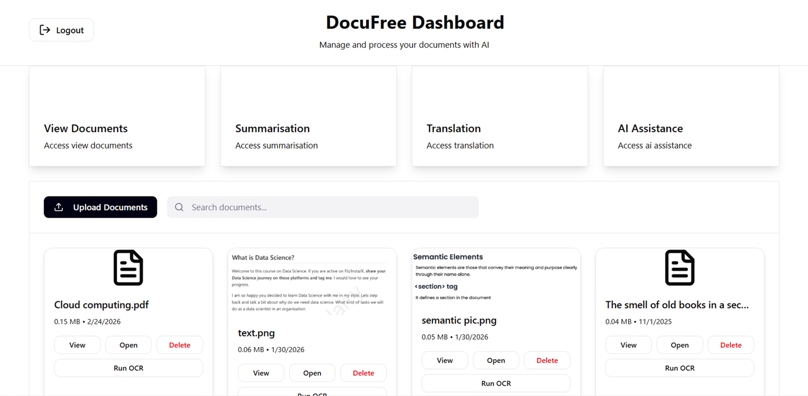
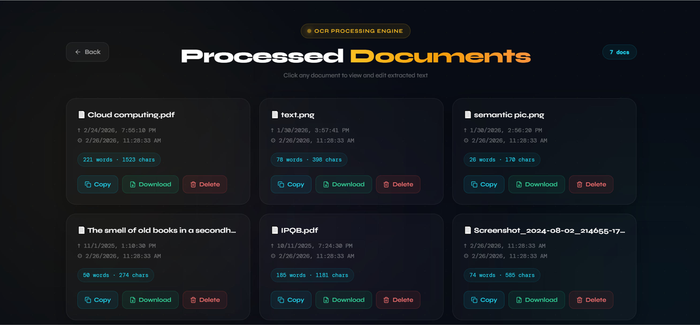
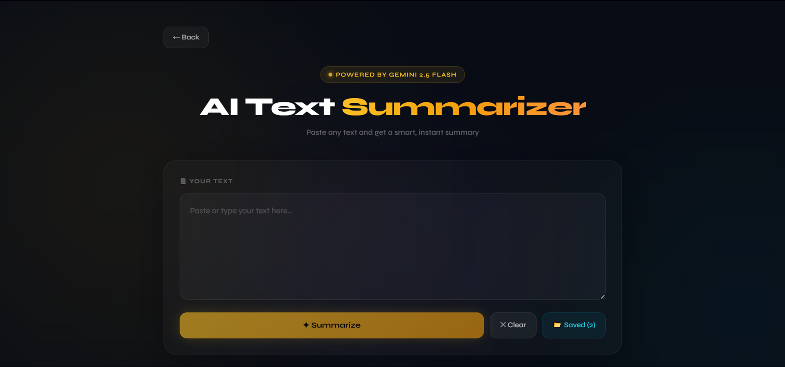
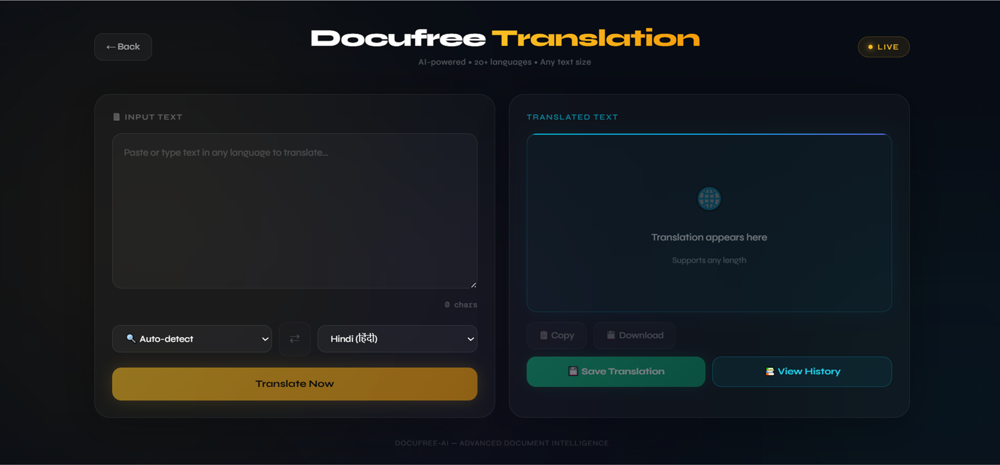
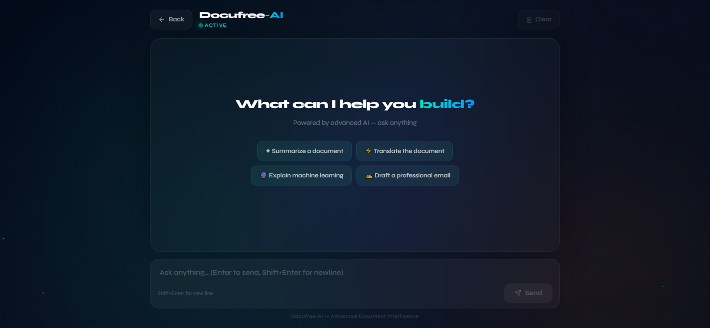
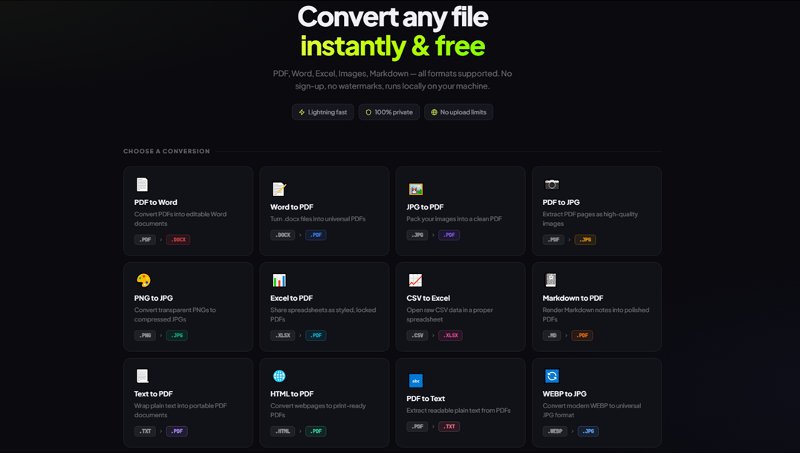

# DocuFree

DocuFree is an AI-powered document processing web application that allows users to extract, summarize, translate, convert, interact with, and listen to documents using modern AI technologies.

---

## Features

- OCR-based document text extraction  
- AI-powered text summarization  
- AI-powered document Q&A  
- Multi-language translation  
- Text-to-Speech conversion  
- Document format conversion (PDF, Word, JPG, PNG, etc.)  
- Clean and user-friendly interface  

---

## Tech Stack

### Frontend
- React
- TypeScript
- Tailwind CSS

### Backend
- Node.js
- Express

### AI Services
- Google Gemini API
- OCR processing using Tesseract.js

---

## Screenshots
### Document Upload


### OCR Extraction


### AI Summarization


### Translation


### AI Assistance (Q&A)


### Document Converter

---

## Installation

Clone the repository:

```bash
git clone https://github.com/snehalogic/DocuFree.git
```

## Install dependencies:
npm install

## Create a .env file and add:
GEMINI_API_KEY=your_api_key
MONGODB_URI=your_database_uri

## Run the project:
npm start

## Future Improvements
- Cloud document storage
- Voice-controlled document assistant
